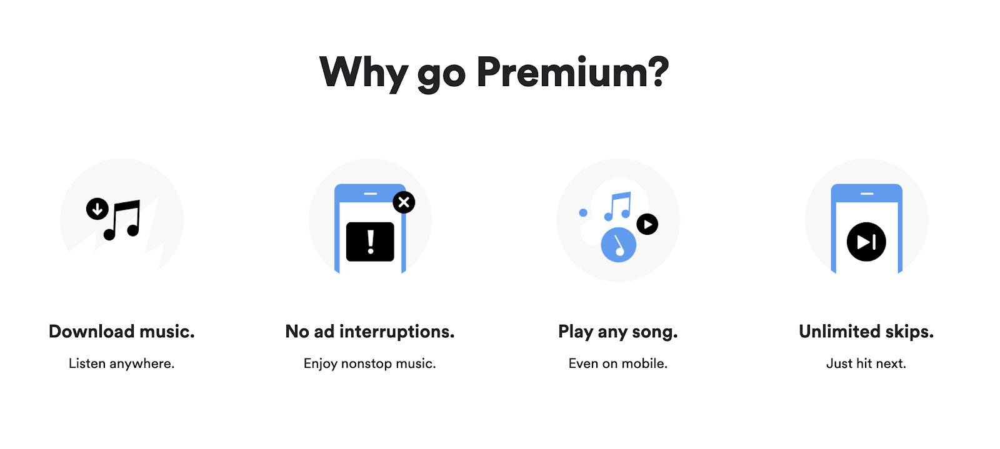

# Oppgavetekst
I denne oppgaven skal du kopiere en Spotify-layout. Du skal lage CSS-koden som gjør at eksemplet ditt vil likne mest mulig på dette bildet:

## Instruksjoner for innlevering
Denne oppgaven skal løses i GitSpeak sammen med en medelev. Det vil si at en av dere leverer inn oppgaven via sin GitSpeak-konto, men at dere samarbeider om løsningen. 

Velg hvilken elev som skal levere inn oppgaven gjennom sin GitSpeak-konto. Inviter deretter den andre medeleven til oppgaven via GitSpeak.

Når dere har skrevet ferdig koden deres skal dere levere inn koden til læreren. Dere trenger ikke å forklare koden. Trykk på "Lever til lærer". Søk opp navnet på læreren deres og velg vedkommende. Trykk på "Lever inn".

## Tilbakemeldingsformat
I denne oppgaven vil læreren gi videotilbakemelding via GitSpeak-appen. Dere vil se tilbakemeldingen som et video-ikon under innleveringen deres. Trykk på dette ikonet for å se gjennom tilbakemeldingen.
